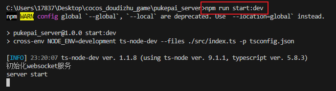

# cocos_doudizhu_game

# 项目介绍

- cocos creator 3.85 版本 + node（服务） + mysql（数据库） 开发斗地主<strong>微信</strong>游戏 Demo
- nodejs 服务中，斗地主<strong>游戏中状态</strong>都是存储在<strong>内存中</strong>，比如玩家扑克牌、房间信息、准备状态、游戏状态等，游戏对局结束会存储玩家对局信息入库，游戏中不会存储状态（设计初觉得游戏对局中状态频繁写入数据库太过麻烦，可能还有延迟，后期也不想改用 Redis 数据库）

# 1、数据库初始化

- mysql 数据库初始化（需要安装 mysql 数据库）
- 使用 navicat 连接本地 mysql、
- 找到项目根目录下，<strong>cocos_doudizhu_game/playing_card.sql</strong> 文件
- 使用 navicat 导入数据库，导入 playing_card.sql 文件（导入表数据可以删除，主要是表和字段）
  
- 注意：<strong>导入后记得刷新一下可能才会展示数据库</strong>

# 2、服务端 server 运行

- nodejs 服务端（依赖 node 环境，本人采用 node v18.3.0 版本，如果有问题就使用该版本）
- 修改 node server 连接本地 mysql 密码 (代码默认采用 123456，如果你的也是不用修改了)
  - 进入 pukepai_server\src\mysql\index.ts 目录下
  - 修改 password 密码为你的本地 mysql 密码
    
- 进入 pukepai_server 目录下，执行命令行命令

  ```shell
  npm install  # 安装依赖
  ```

  ```shell
  npm run start:dev  # 安装依赖
  ```

  

  ```shell
  npm run build  # 打包node ts 服务，转为js 文件，部署使用
  ```

  - 打包目录为 pukepai_server/puke_server 下
  - 进入 pukepai_server/puke_server 目录执行 node index.js 启动打包之后的 node 服务
  - 可以直接复制这个文件夹放到服务器中安装依赖，然后启动 node 服务即可

# 3、运行客户端

- 客户端:
- 打开 cocos creator 客户端
- 项目中直接导入 pukepai 目录即可
  

# 4、恭喜你完成项目的配置，可以运行了


# 5、cocos creator 打包

- cocos 项目构建发布中我配置了一个默认的微信小程序，可以自行修改 appid
  
- 修改为自己的微信小程序 appid
  
- 打包之后打开微信小游戏，勾选不校验合法域名（因为调用本地接口）
  

# 6、斗地主游戏功能（demo 可能有 bug）

- 匹配模式：全部玩家进行匹配，至少 3 个人开始对局
  
- 创建房间模式：创建房间，wx 邀请好友，或通过房间号加入游戏
  
- 游戏对局：包含抢地主、加倍、明牌、机器人托管、断线重连等功能
  

# 7、微信功能

- #### 微信登录功能

- 在 pukepai_server\src\router\wx_login.ts 目录下，修改 appid、appsecret 修改为自己微信小游戏的 appid、appsecret
  
- 修改之后就可以调用微信登录功能了

- #### 微信分享房间功能
- 在 pukepai\assets\Script\RoomScene\RoomScene.ts 目录下，wxShare 方法中修改图片路径（默认图片使用的是 pukepai_server 中 pukepai_server\static\images\roomShare.png 图片）
- 注意：微信游戏上线后，图片的域名需要配置微信白名单中才可以显示
  

# 8、如果遇到什么问题欢迎提交 issue
